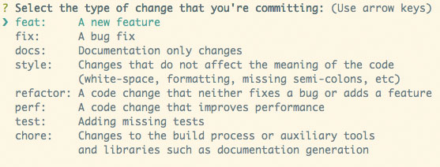

# Automatic verificator of HTML and MD 

## Commit Naming Rules

```text
feat: Add beta sequence
^--^  ^---------------^
|     |
|     +-> Summary in present tense.
|
+-------> Type: chore, docs, feat, fix, refactor, style, or test.
```
## How to use

Create a folder inside /essays and give it a name.
After that every file in this folder will have to follow the convention:
"name - folder name"
After every push to the repository, Github actions will check commits, file names and validity of html and md files.

## Run locally

```bash
npm install
npm run check
```
## File name check
To check the name of files we use [node-dir](https://www.npmjs.com/package/node-dir).
It runs automatically before commit(locally) and after push(in github actions).
First the name of the folder is extracted.
Then the names of files are checked with regex.
file name convention:
"name - folder name"

## HTML check
To check html we use [html-validator](https://www.npmjs.com/package/html-validator).
It runs automatically before commit(locally) and after push(in github actions).

## MD check
To check md we use [markdownlint](https://www.npmjs.com/package/markdownlint).
It runs automatically before commit(locally) and after push(in github actions).

## Commit validation
We use [commitizen](https://www.npmjs.com/package/commitizen) to impose the commit convention.
We also check the commit in github actions. 
Just type:
```bash
git commit
```
You will see this menu. Follow the instructions and the commit message will be generated.
